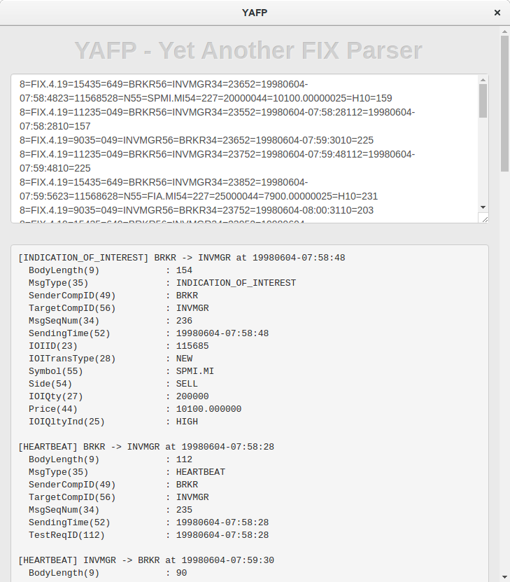

# Yet-Another-FIX-Parser
Yet Another FIX Parser is a parser for FIX (Financial Information eXchange) protocol logs. 
It runs as a Chrome App that doesn't require any network access. Your input will not be sent to the Internet.

# Installation
1. Clone this repository.
2. Start Google Chrome v50 or newer.
3. Open the apps and extensions management page by clicking the settings icon and choosing Tools > Extensions.
4. Make sure the Developer mode checkbox has been selected.
5. Click the Load unpacked extension button, navigate to the app's folder and click OK.

# Usage

Start from Chrome app launcher (chrome://apps).
Paste FIX logs in the top text area. The delimiter of FIX tags can be any single character, including |, ^ and a control character like SOH.

# Custom tags
You can add your custom tags to the parser. FIX tags are defined in js/FIX.json file.
