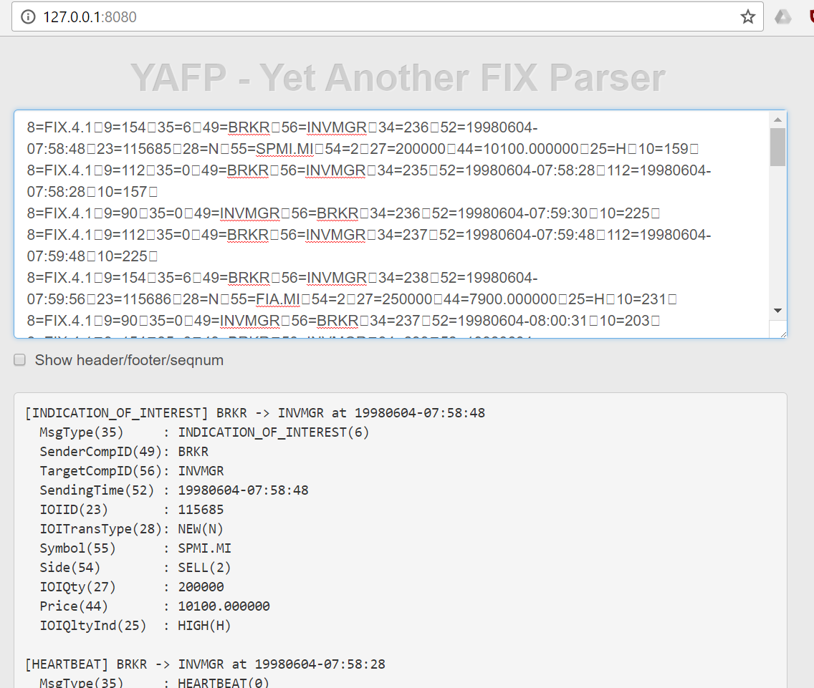

# Yet-Another-FIX-Parser
Yet Another FIX Parser is a parser for FIX (Financial Information eXchange) protocol logs. It made only by client scripts. You can run the application on any http server by simply specifying index.html as a start page.

The web app version is available on hyperdev, [https://luck-razor.hyperdev.space/](https://luck-razor.hyperdev.space/)

# Installation

1. Clone this repository.
2. Run [yarn](https://yarnpkg.com) in the directory

# Usage

Paste FIX logs in the top text area. The delimiter of FIX tags can be any single character, including |, ^ and a control character like SOH.

# Custom tags
You can add your custom tags to the parser. FIX tags are defined in src/FixDic.json file.
